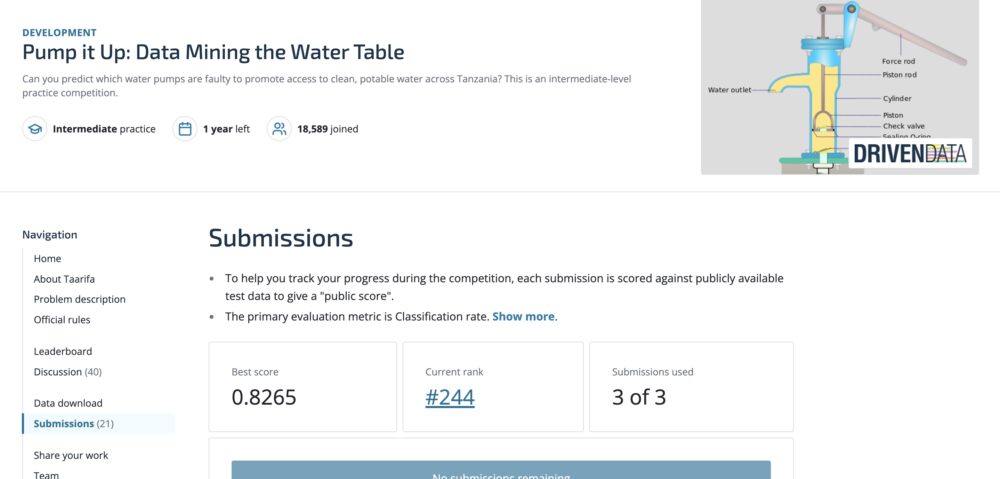

# Waterpoint Functionality Prediction in Tanzania

This project predicts the operational status of water pumps in Tanzania for the **Pump it Up** competition (DrivenData).\
Below are the **instructions to reproduce** our results.

> **Note 0.** The path `.libPaths("/dss/dsshome1/01/ra59qow2/R/x86_64-pc-linux-gnu-library/4.3")` in some scripts is a cluster-specific absolute path. Please change it to your own path.

1.  **Setup**

    -   Save the four raw datasets (CSV files) in the `data/` folder.
    -   Run `setup.R`.

2.  **Data preprocessing** (see `data_preprocessing/`)

    -   `data_combining.R` — joins the three tables (train values/labels, test values) into one.
    -   `data_cleaning.R` — performs initial cleaning and simple feature engineering.
    -   `funder.R` — handles the high cardinality of text features.
    -   `spatial_preprocessing.R` — adds spatially enhanced features.
    -   `data_imputed.R` — applies imputation on the regular dataset and creates the regular-imputed dataset.
    -   `data_spatial_large.R` — creates the enhanced dataset and the enhanced-imputed dataset.
    -   `cluster_eva.R` — evaluates the silhouette score of the spatial clusters.
    -   `toy_example.R` — visualizes a toy example of how external population estimates are extrapolated.

3.  **Baselines** (see `baseline/`)

    -   `bs_non_imp.R` — evaluates baseline models on the non-imputed dataset.
    -   `bs_imp_*.R` — evaluates baseline models on the imputed dataset; results are saved per model.

4.  **Tuning** (see `tuning/`)

    -   `*_tuning.R` — tunes **CatBoost**, **XGBoost**, and **Ranger** on the imputed-enhanced dataset and saves the tuning archive and the top-10 parameter sets.
    -   `convergence_plot.R` visualize the tuning archive of ranger-mbo and XGB-mbo.

5.  **Submissions for base models** (see `baseline_submitted/`)

    -   Files ending with `_s.R` — output submission files for **non-tuned** models.
    -   Files ending with `_ts.R` — output submission files for **tuned** models.

6.  **Stacking** (see `stack/`)

    -   Scripts generate submissions for different base & super-learner combinations.
    -   `stack_R*.R` refers to the stack orders described in the report, while `stack_app*.R` refers to those shown in the appendix.
    -   `stack_R5.R` yields the best submission score.

7.  **Cascaded modeling** (see `cascaded/`)

    -   Contains our design and code to **reproduce** the cascading modeling approach.

8.  **Additions** (see `additions/`) — These scripts are not used in the final report but may provide additional insights:

    -   `Imputation_*.R` — conducts a benchmark study of how different imputation methods affect model performance.
    -   `PFI_.R` — applies Permutation Feature Importance to the stack model for explainability. Due to limited computational resources, the script may result in a runtime error.

9.  **Data tables and plots** (see `table&plotting/`) — These scripts serve as supplementary materials:

    -   `data quality report.R` — provides data quality tables for the original dataset.
    -   `redundant_var.R` — provides tables for identifying redundant or similar columns.
    -   `geo_plot.R` — provides the pump distribution plot.
    -   `missingness_plot.R` — provides missingness plots to explore missing data patterns.
    -   `population_plot.R` — provides the distribution plot of the population variable.
    -   `target&leaflet_plot.R` — provides the target distribution as bar plots.
    -   `final_plot.R` — provides the final prediction of our best models on the Tanzania map.

This is the final score and ranking of us: 
